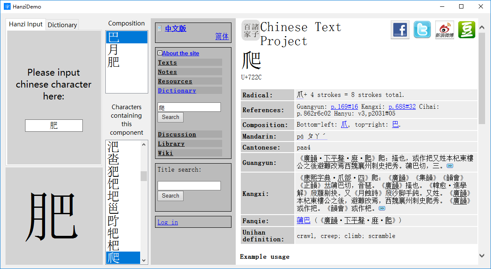
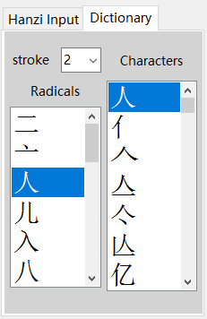
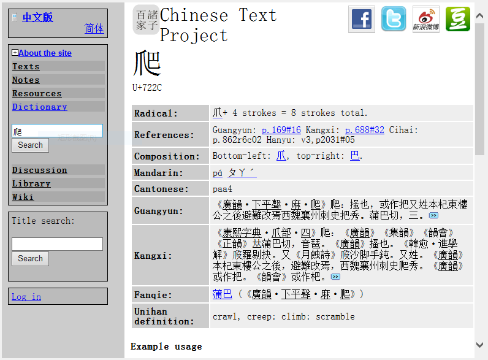
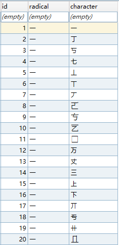
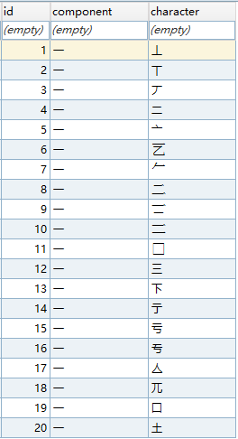
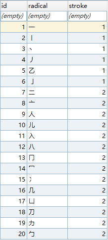

# Hanzi (Chinese character)

Hanzi is an electronic dictionary for Chinese character study, it contains more than 80,000 Chinese characters.

You can find a Chinese character by the following ways:

- Input character directly
- By querying its radical
- By entering a component of the character

## Download

- [Hanzi Demo & Chinese character database](https://github.com/jsksxs360/Hanzi/releases/)

## Useage

You can input a Chinese character by two ways: inputing a Chinese character directly in the `Hanzi Input` tab or querying a character by its radical in the `Dictionary` tab.

The area on the left bottom will show the character selected, you can click this area to search a character directly.

In the `Dictionary` tab, you can find a radical by the number of its strokes, and then the `Characters` list will show all the characters of this redical.

When a Chinese character is selected, the `Composition` list will show components of the character (including itself). And when a component is selected, the list blow will show all the characters containing this component.

The area on the right is a web window, which will show information of the character you selected on http://ctext.org/ . So a network connection is needed when you use this software.

## SQLite Database

Hanzi project also provide a Chinese character SQLite database which is collected from **ctext.org** website. You can view the contents of the data table by downloading [SQLiteExpert](http://www.sqliteexpert.com/).

This Database contains three tables:

- character
- component
- radical

**Table character**: character and radical of the character.

**Table component**: character and its component.

**Table radical**: radical and number of its stroke.

